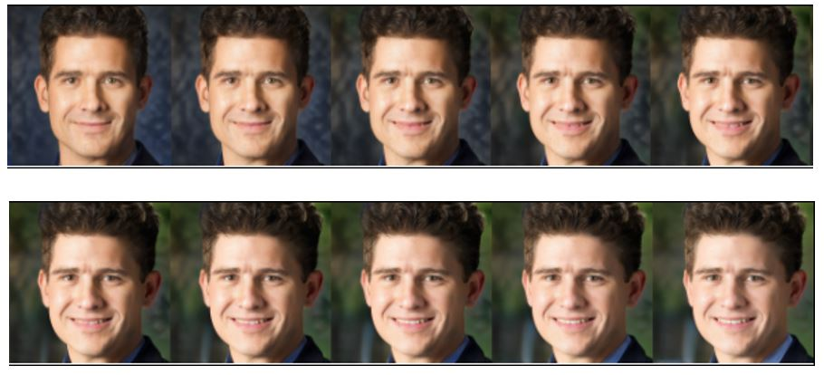
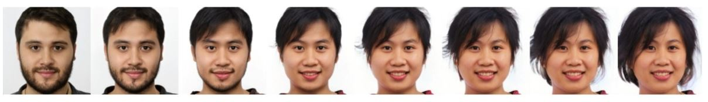

# Interpreting-the-latent-space-of-GANs-for-semantic-face-editing-
This project aims to build a controllable Generative Adversarial Network (GAN) that facilitates the control of facial attributes through manipulation of latent space. We have used pre-trained StyleGAN2-ADA to generate photorealistic faces and SVM hyperplanes to interpret it’s latent space. This allowed us to understand the encoding of facial semantics and their disentanglement in the latent space learnt by GAN.

# Technical Details
An unconditional GAN is trained to generate the photorealistic faces using CelebA dataset containing celebrity images. A convolutional neural network is trained to predict
the facial semantics of the faces generated by GAN. The latent vectors and corresponding facial semantics together form a labelled dataset for training SVM. SVM classifiers
with linear kernels are trained to find the hyperplanes in the latent space that can be used to edit the faces corresponding to latent vectors. We observed entanglement in the latent space learnt by GAN. An attempt is made to resolve the entanglement using subspace projection.

# Facial Semantic Classifier
We have implemented the Facial Semantic Classifier for 6 attributes that are Smile,Gender,Age, Double Chin, Eyeglasses, Moustache. The corresponding positive directions
are defined as laughing, female, young, No double chin, No eyeglasses and no Moustache. We can plug in more attributes by just giving the attribute number in the code.
For this model we have Implemented Convolution Neural Network(CNN) where each layer consists of one Convolution layer followed by a Max Pooling Layer. The input image is first resized to 128x128 and then passed to the CNN . Architecture of the CNN is as follows.

# SVM Classifier
We have made an assumption that the facial semantics are binary and for each such semantic, there exists a hyperplane in the latent space that separates the latent vectors
corresponding to faces with positive and negative facial semantic. These Hyperplanes are found by training SVM classifiers with linear kernels using the labelled dataset containing latent vectors and corresponding facial semantics. Let the latent vector be z = [z1, z2, ..., z512]. Hyperplane found by SVM is w1z1 + w2z2 + ... + w512z512 + w0 = 0.
Each hyperplane has an associated normal vector (512-dimensional) n = [w1,w2, ...,w512]. Facial semantic corresponding to this normal vector can be edited as zedit = z + α ∗ n.
Multiple facial semantics can be edited as zedit = z + α1 ∗ n1 + α2 ∗ n2. If facial semantics are to be edited in the direction opposite to normal vector, negative values of alpha can be used. Performance of SVM hyperplanes is computed on the test set to evaluate the validity of assumptions about latent space.

# Single Attribute Manipulation

## Atrribute-Smile

Manipulating smile in increasing intensity, using values of α from 0 to 50 with step size of 5.

## Atrribute-Gender

Manipulating gender from Male to Female using values of α from 0 to -56 with step size of 7.

## Entalement between Eye-glasses and Age

Presence of entanglement between eyeglasses and age

